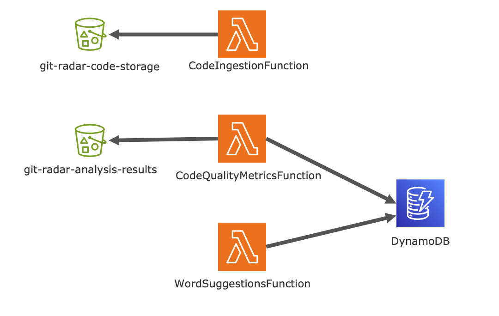

# GitRadar project for TSCD
## Introduction
GitRadar is a distributed system designed to analyze code repositories, generate code quality metrics, and provide context-based word suggestions. The project leverages AWS services, including Lambda functions, S3 buckets, DynamoDB, with LocalStack for local development.

## Tools Used
- **Docker**: For containerization to ensure consistency across different environments.
- **LocalStack**: Local AWS cloud stack for testing and development.
- **Github Actions**: GitHub Actions is used for continuous integration and continuous deployment.
## Architecture
- **S3 Buckets**:
  - git-radar-code-storage: Stores ingested code files. 
  - git-radar-analysis-results: Stores code analysis results. 

- **Lambda Functions**:
  - CodeIngestionFunction: Ingests code from GitHub repositories and stores it in git-radar-code-storage.
  - CodeQualityMetricsFunction: Analyzes code metrics and stores results in git-radar-analysis-results.
  - WordSuggestionsFunction: Provides context-sensitive word suggestions and stores them in DynamoDB.

- **DynamoDB**: 
  - **CodeQualityMetrics**: Stores code quality metrics.
  - **WordSuggestions**: Stores context data and word suggestions.




## Configuration and Deployment
**Installing dependencies**:
   
```bash
   python3 -m venv env
   source env/bin/activate
   pip install boto3 requests radon
 ```

1. **Run LocalStack**:
   
    ```bash
   docker run -d -p 4566:4566 -p 4571:4571 --name localstack \
   -e SERVICES=s3,lambda,dynamodb,cloudformation,iam,rds \
   -v /var/run/docker.sock:/var/run/docker.sock \
   localstack/localstack
   ```

2.  **Configure AWS CLI for LocalStack**:

    ```bash
    aws configure --profile localstack
    ```
3. **Creation of S3 buckets**:

    ```bash
    aws --endpoint-url=http://localhost:4566 s3 mb s3://git-radar-code-storage --profile localstack
   aws --endpoint-url=http://localhost:4566 s3 mb s3://git-radar-analysis-results --profile localstack
    ```
4. **Creation and uploading Lambda functions to S3 bucket**:

    Code Ingestion Function:

    ```bash
    zip -r code_ingestion.zip code_ingestion.py
    aws --endpoint-url=http://localhost:4566 s3 cp code_ingestion.zip s3://git-radar-code-storage/code_ingestion.zip --profile localstack
    ```
   Code Quality Metrics Function:
    ```bash
   cd code_quality_metrics
   cp ../code_quality_metrics.py .
   zip -r9 ../code_quality_metrics.zip .
   aws --endpoint-url=http://localhost:4566 s3 cp ../code_quality_metrics.zip s3://git-radar-code-storage/code_quality_metrics.zip --profile localstack
    ```
   
    Word Suggestions Function:
    ```bash
   cd word_suggestions
   cp ../word_suggestions.py .
   zip -r9 ../word_suggestions.zip .
   aws --endpoint-url=http://localhost:4566 s3 cp ../word_suggestions.zip s3://git-radar-code-storage/word_suggestions.zip --profile localstack
    ```

5. **Deploy CloudFormation stack**:

    ```bash
    aws --endpoint-url=http://localhost:4566 cloudformation create-stack \
            --stack-name GitRadarStack \
            --template-body file://template.yaml \
            --capabilities CAPABILITY_NAMED_IAM \
            --profile localstack
    ```
   

## Tests

6. **Invoke the Lambda Functions with the Test JSON**:

    Uploading necessary test files:

    ```bash
    aws --endpoint-url=http://localhost:4566 s3 cp test.json s3://git-radar-code-storage/test.json --profile localstack
    aws --endpoint-url=http://localhost:4566 s3 cp test2.json s3://git-radar-code-storage/test2.json --profile localstack
    aws --endpoint-url=http://localhost:4566 s3 cp test3.json s3://git-radar-code-storage/test3.json --profile localstack
    aws --endpoint-url=http://localhost:4566 s3 cp code.py s3://git-radar-code-storage/code.py --profile localstack
    ```
   
    Code Ingestion Function:

    ```bash
    aws --endpoint-url=http://localhost:4566 lambda invoke \
    --function-name CodeIngestionFunction \
    --payload file://test.json \
    output.txt \
    --profile localstack
   cat output.txt
    ```
   Code Quality Metrics Function:
    ```bash
    aws --endpoint-url=http://localhost:4566 lambda invoke \
   --function-name CodeQualityMetricsFunction \
    --payload file://test2.json \
    output_code_quality_metrics.txt \
    --profile localstack
    cat output_code_quality_metrics.txt
    ```
   Word Suggestions Function:
    ```bash
   aws --endpoint-url=http://localhost:4566 lambda invoke \
    --function-name WordSuggestionsFunction \
    --payload file://test3.json \
    output_word_suggestions.txt \
    --profile localstack 
    cat output_word_suggestions.txt
   ```
7. **Access Data from DynamoDB**:

    List all items:

    ```bash
    aws --endpoint-url=http://localhost:4566 dynamodb scan --table-name CodeQualityMetrics --profile localstack
    aws --endpoint-url=http://localhost:4566 dynamodb scan --table-name WordSuggestions --profile localstack
    ```
**Additional useful commands**:

Stopping and removing Localstack Docker container:

```bash
docker stop localstack
docker rm localstack
```

Checking CloudFormation stack upload status:

```bash
aws --endpoint-url=http://localhost:4566 cloudformation describe-stacks --stack-name GitRadarStack --profile localstack
```
Delete CloudFormation stack:

```bash
aws --endpoint-url=http://localhost:4566 cloudformation delete-stack \
--stack-name GitRadarStack \
--profile localstack
```

Update CloudFormation stack:

```bash
aws --endpoint-url=http://localhost:4566 cloudformation update-stack \
  --stack-name GitRadarStack \
  --template-body file://template.yaml \
  --capabilities CAPABILITY_NAMED_IAM \
  --profile localstack
```


List all S3 buckets:

```bash
aws --endpoint-url=http://localhost:4566 s3 ls --profile localstack
```
List content of S3 bucket:

```bash
aws --endpoint-url=http://localhost:4566 s3 ls s3://git-radar-code-storage/ --profile localstack
```

List Lambda functions:

```bash
aws --endpoint-url=http://localhost:4566 lambda list-functions --profile localstack
```


## Clone repository:

```bash
git clone https://github.com/ana-4/TSCD
```


